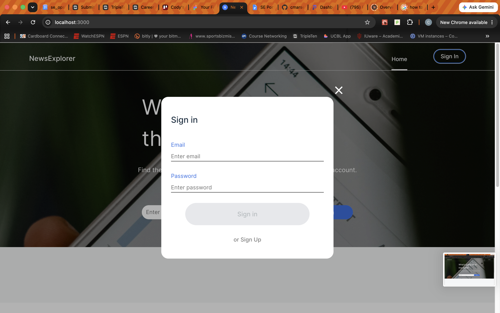
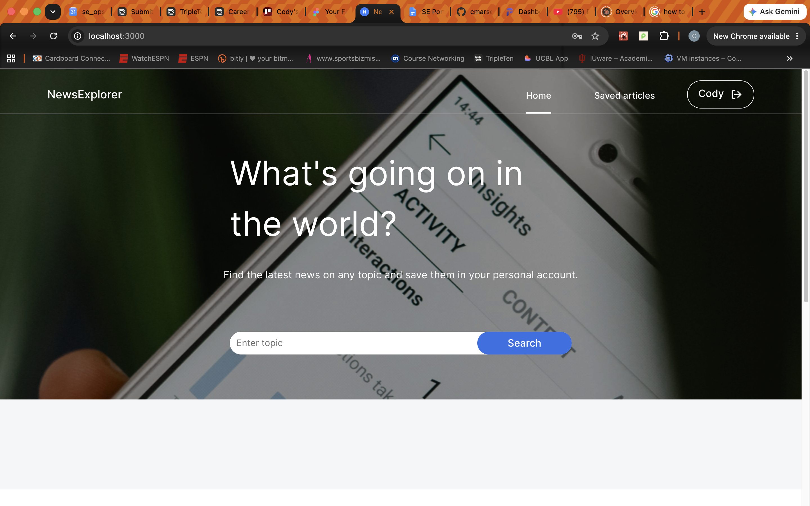
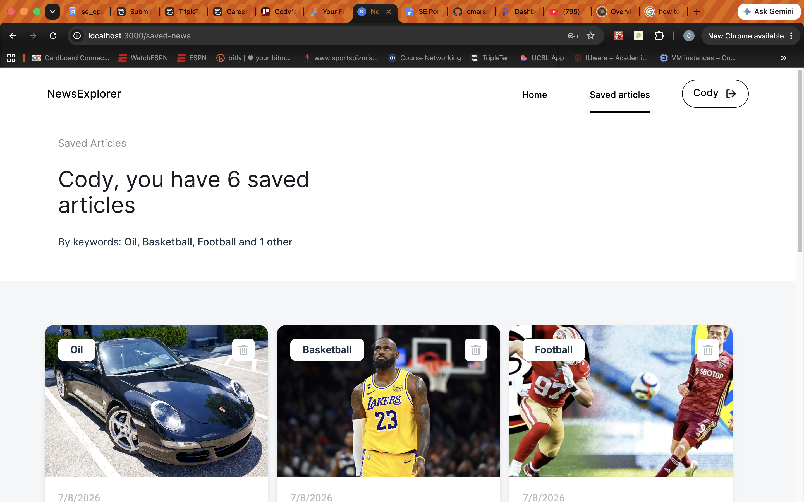
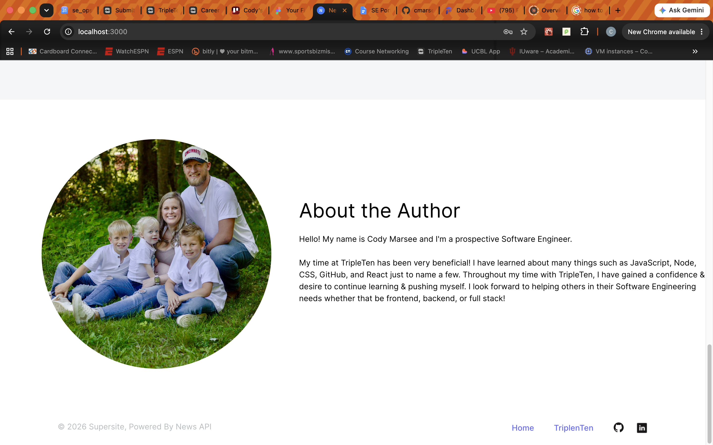

# NewsExplorer

NewsExplorer is a responsive news search application that lets users find articles on any topic, save the ones they care about to a personal account, and revisit them later — organized automatically by the keywords they searched for.

This repository contains the **frontend** of the project. The backend is being simutlated for the purpose of the project.

## Screenshots

**Homepage**


**Sign In**



**Search Results**



**Saved Articles**



**About the Author**



## Features

- **Keyword search** — pulls live articles from [NewsAPI](https://newsapi.org/) based on any topic entered by the user, with client-side validation (an empty search shows an inline "Please enter a keyword" error rather than firing a request).
- **Authentication** — sign up and sign in via modal forms, with real-time field validation and error messaging.
- **Save & remove articles** — logged-in users can bookmark any search result; saved articles can be removed either from the homepage or from the dedicated Saved Articles page.
- **Saved Articles page** — displays a personalized count of saved articles and automatically summarizes them by keyword (e.g. _"By keywords: Nature, Yellowstone, and 2 other"_).
- **Fully responsive layout** — custom breakpoints for desktop, tablet, and mobile, including a collapsible dropdown navigation menu on small screens.
- **Graceful empty/error states** — distinct UI for "no search performed yet," "search returned nothing," and "the request failed," so the results section always gives clear feedback.

## Tech Stack

- **React** (function components, hooks)
- **React Router** for client-side routing (`/`, `/saved-news`)
- **Context API** for global state (current user, saved articles, search keyword, current route)
- **Custom hooks** for form state and validation
- **Vite** as the build tool/dev server
- **Plain CSS** with custom responsive breakpoints (no CSS framework)
- **NewsAPI** as the external article data source

## Getting Started

### Prerequisites

- Node.js (v18 or later recommended)
- npm
- A running instance of the [backend API](#) (update this link once the backend repo is public/deployed)

### Installation

```bash
git clone https://github.com/cmarsee-blip/se_project_news_explorer.git
cd se_project_news_explorer
npm install
```

### Running locally

```bash
npm run dev
```

By default this runs on `http://localhost:3000`. Make sure the backend is running and reachable at the URL this project expects (check the API utility files for the base URL configuration).

### Building for production

```bash
npm run build
```

## Project Structure

```
src/
├── components/       # React components (Header, Main, SearchForm, NewsCard, Profile, modals, etc.)
├── contexts/         # React Context providers (CurrentUser, SavedArticles, Keyword, CurrentPage)
├── hooks/            # Custom hooks (form validation, etc.)
├── utils/            # API helper functions (NewsAPI, backend auth/articles)
└── assets/           # Images, icons, and fonts
```

## Live Demo

_Add your deployed link here once the project is live._

## Author

**Cody Marsee** — prospective Software Engineer, TripleTen graduate

- [GitHub](https://github.com/cmarsee-blip)
- [LinkedIn](https://www.linkedin.com/in/codymarsee)

## Acknowledgments

- Built as a capstone project for the [TripleTen](https://tripleten.com/) Software Engineering program
- Article data provided by [NewsAPI](https://newsapi.org/)
